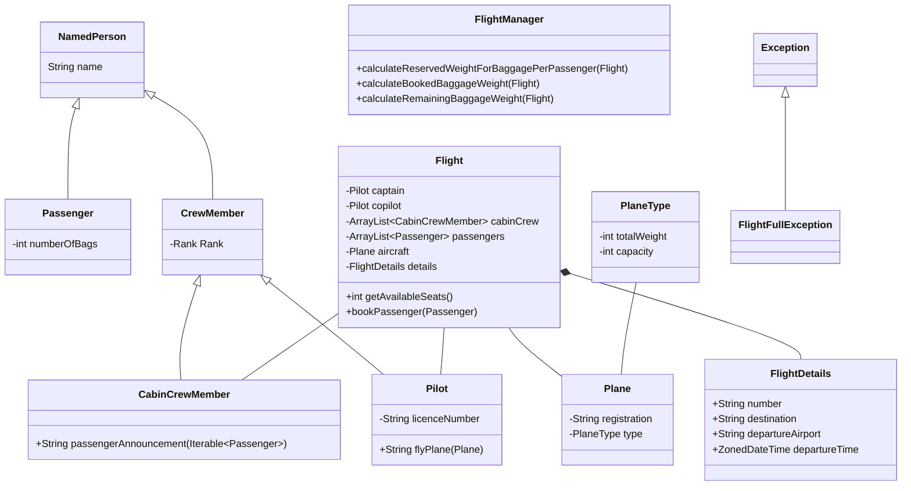

Enums are used for Ranks and for PlaneTypes.  If we weren't to use enums for these,
we would end up wanting to define the common properties of these such as capcitiy and weight
in static objects that would be reused in multiple places in our code.

FlightDetails is treated as a 'record' object and is compared by value not reference, and is also immutable.

ZonedDateTime is from java.base.

Interesting issue: RANK is separate from the subclasses for Pilot and CabinCrewMember and
it has invalid ranks for some subclasses!  eg. a Pilot should not be a PURSER.

CrewMember and NamedPerson should be abstract

If I make FlightDetails immutable, the Flight needs to update the whole object.

How much should I check for null?